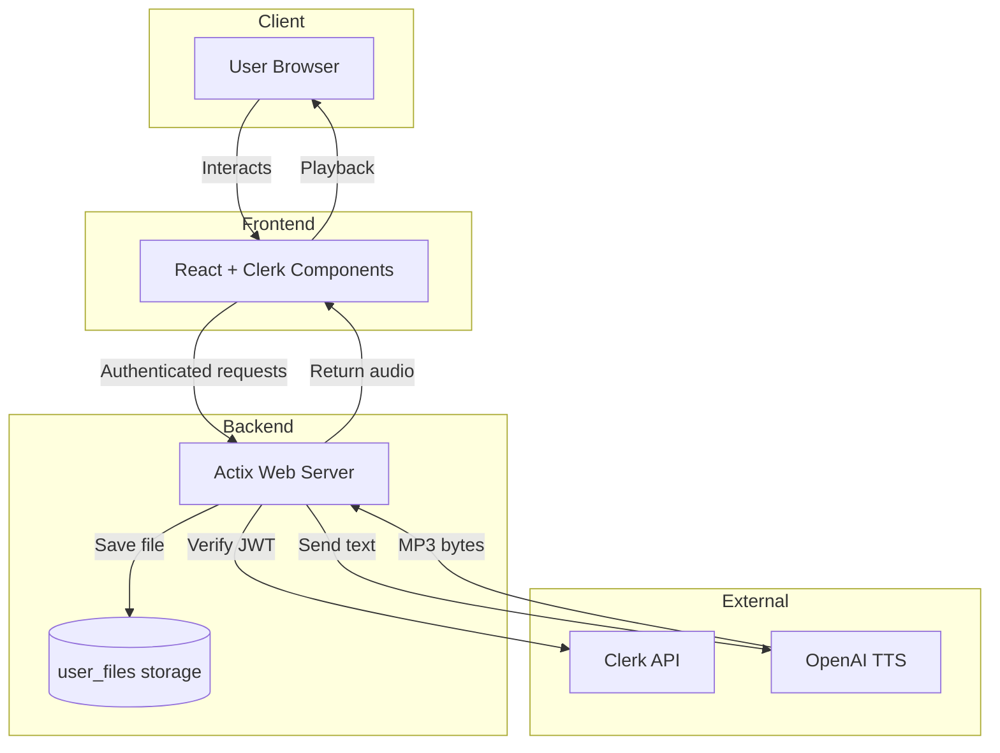

# Using Clerk auth with a Rust Actix web backend

This template uses Actix-web and the clerk-rs crate for providing authentication from Clerk in the backend.

The frontend is a simple React app that uses Clerk's React components.

The template simply shows a list of all signed up users after you sign in, but it can be extended to create a full app with authenticated endpoints.

## How to use this template

Sign up at clerk.com, go to the dashboard and create an application with the sign-in options you prefer.

Get the `CLERK_SECRET_KEY` secret and put it in `backend/Secrets.toml`.
Make sure you don't commit this file.

Get the `VITE_CLERK_PUBLISHABLE_KEY` secret and put it in `frontend/.env`.

> The frontend was initialized from the React+TS template in `npm create vite@latest`.
> The Clerk components were then added by following the guide at <https://clerk.com/docs/quickstarts/react>.

cd into the frontend and run `npm install` and `npm run build`. This builds the frontend assets and places them in `frontend/dist`.

cd back to the root and run `shuttle run`.
The backend serves the web page from the dist folder, and an auth-protected API that fetches the list of all users that have signed up so far.

You can then do `shuttle deploy`, but consider switching to a production key from Clerk.
The development key can still be used in `Secrets.dev.toml`.

## Architecture

# orca-whirlpool-dashboard
